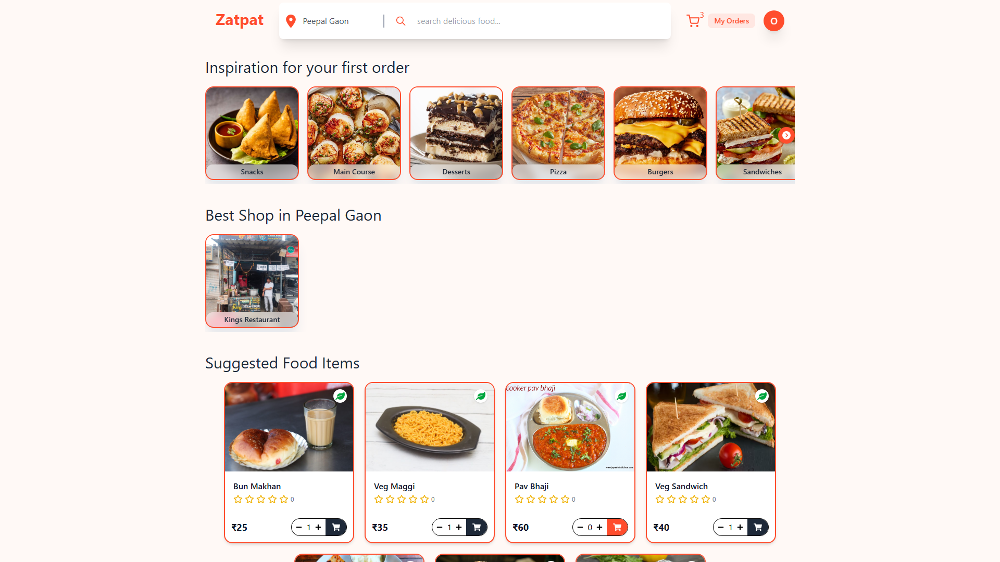
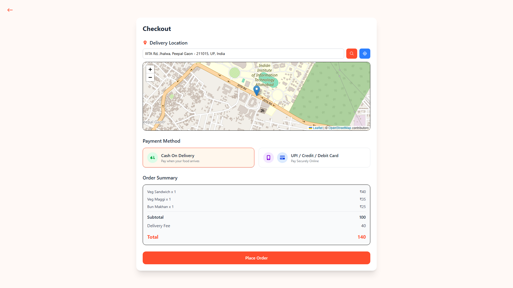
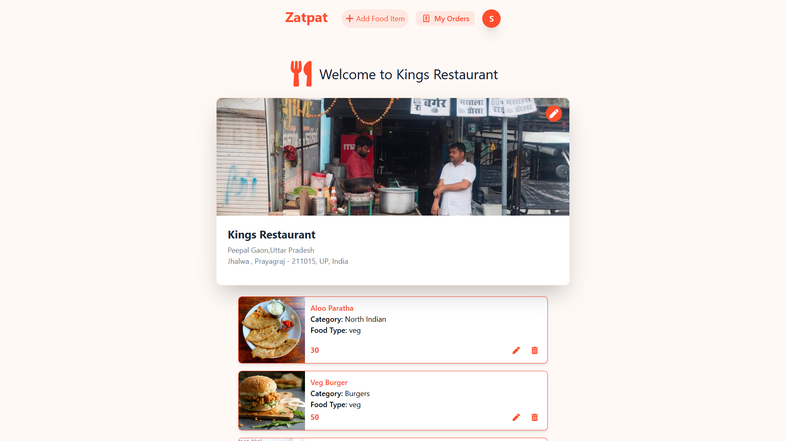
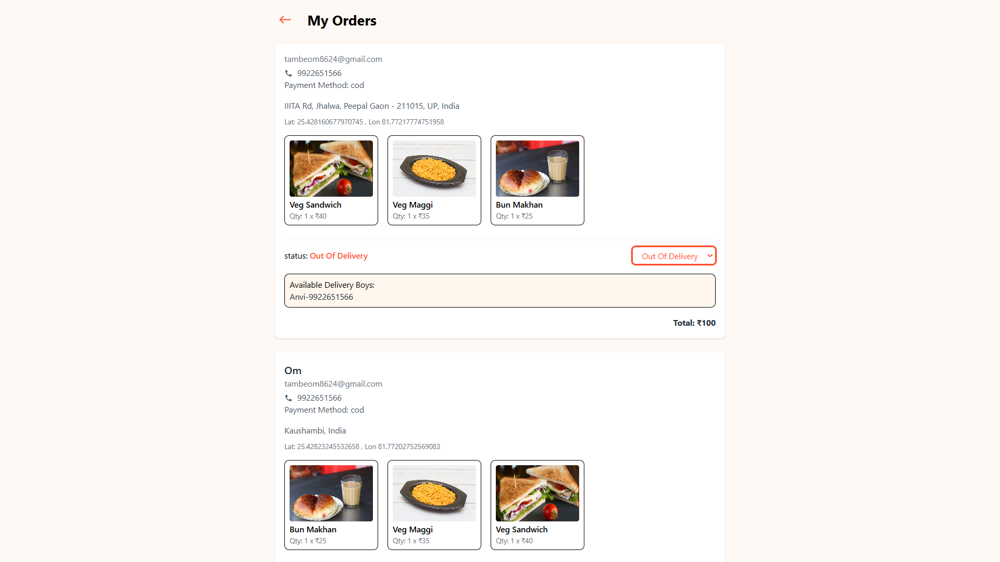
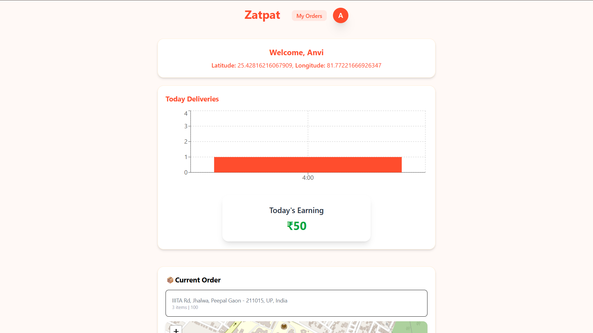

# 🛵 Zatpat - Real-Time Food Delivery & Logistics Platform


## 📋 Project Overview

**Zatpat** is a scalable, hyperlocal food delivery ecosystem engineered to solve last-mile logistics challenges. Unlike standard CRUD applications, Zatpat utilizes **Event-Driven Architecture** to enable bi-directional, real-time communication between three distinct user roles: **Customers, Restaurant Partners, and Delivery Riders**.

This project demonstrates the implementation of complex system design patterns including **Geospatial Indexing**, **WebSocket "Handshakes"**, and **Role-Based Access Control (RBAC)** security.

---

## 📸 Application Layout & Screenshots

### 👤 Customer (User) View
| **Home & Food Menu** | **Real-Time Order Tracking** |
|:---:|:---:|
|  |  |
| *Browse restaurants and add items to cart.* | *Live updates of rider location on the map.* |

### 👨‍🍳 Restaurant Owner (Admin) View
| **Merchant Dashboard** | **Order Management** |
|:---:|:---:|
|  |  |
| *Overview of total sales and active orders.* | *Accept/Reject orders and manage status.* |

### 🛵 Delivery Partner (Rider) View
| **Rider Job Panel** | **Navigation & Delivery** |
|:---:|:---:|
|  |  |
| *View available delivery requests nearby.* | *Route navigation to customer location.* |

---

## 🚀 Key Features & Engineering Decisions

### 📡 1. Real-Time Logistics Engine
* **Socket.io Namespaces:** Implemented dedicated WebSocket channels to broadcast delivery rider coordinates specifically to the relevant customer's "Order Room," ensuring data privacy and reducing server load.
* **Geospatial Tracking:** Integrated **Leaflet.js** to render dynamic map layers, achieving sub-second latency for live rider location updates on the frontend.

### 🛡️ 2. Secure & Scalable Architecture
* **Role-Based Access Control (RBAC):** Designed custom middleware to secure API endpoints, differentiating permissions between `Admin`, `Customer`, and `Rider` roles.
* **JWT & OAuth:** Utilized **JSON Web Tokens (JWT)** for stateless session management and **Firebase** for secure, social login authentication.

### 💳 3. Payments & Notifications
* **Transactional Integrity:** Integrated **Razorpay Payment Gateway** with webhook verification to handle payment success/failure states, ensuring PCI-compliant transaction processing.
* **Automated Alerts:** Built an event-trigger system using **Nodemailer** to send transactional emails (invoices, order confirmations) asynchronously.

### ⚡ 4. Performance Optimization
* **Global State Management:** Leveraged **Redux Toolkit** (RTK) to manage complex client-side state (Cart, User Profile, Active Orders), minimizing prop-drilling and reducing redundant API calls by **30%**.
* **Responsive UI:** Developed a mobile-first interface using **Tailwind CSS**, ensuring accessibility across all device types.

---

## 🛠️ Tech Stack

| Domain | Technologies |
| :--- | :--- |
| **Frontend** | React.js, Redux Toolkit, Tailwind CSS, Leaflet.js |
| **Backend** | Node.js, Express.js |
| **Database** | MongoDB (with Geospatial Indexing) |
| **Real-Time** | Socket.io (WebSockets) |
| **Authentication** | JWT, Firebase Auth, BCrypt |
| **Payments** | Razorpay SDK |
| **DevOps/Tools** | Git, Postman, Vercel/Render (Deployment) |

---

## ⚙️ Local Installation Guide

Follow these steps to set up the project locally for testing and development.

### Prerequisites
* Node.js (v14 or higher)
* MongoDB (Local instance or Atlas Connection URL)
* Git

# Zatpat Food Delivery 🍔🚀

A full-stack food delivery web application built using the MERN stack.

---

## 1️⃣ Clone the Repository

```bash
git clone https://github.com/Omtambe99/Zatpat_food_delivery.git
cd Zatpat_food_delivery
```

---

## 2️⃣ Backend Configuration

Navigate to the server directory and install dependencies:

```bash
cd server
npm install
```

### Configure Environment Variables

Create a `.env` file inside the `server` folder and add the following:

```env
PORT=5000
MONGO_URI=your_mongodb_connection_string
JWT_SECRET=your_secret_jwt_key
RAZORPAY_KEY_ID=your_razorpay_key_id
RAZORPAY_KEY_SECRET=your_razorpay_key_secret
EMAIL_SERVICE=gmail
EMAIL_USER=your_email@gmail.com
EMAIL_PASS=your_email_app_password
CLIENT_URL=http://localhost:3000
```

> ⚠️ Replace all placeholder values with your actual credentials.

### Run the Backend Server

```bash
npm run server
```

✅ Server runs on **http://localhost:5000** by default.

---

## 3️⃣ Frontend Configuration

Navigate to the client directory and install dependencies:

```bash
cd client
npm install
npm start
```

✅ Client runs on **http://localhost:3000** by default.

---

## 🔑 Environment Variables

To run this project, make sure the following variables are added to your `.env` file inside the `server` directory:

- `PORT`
- `MONGO_URI`
- `JWT_SECRET`
- `RAZORPAY_KEY_ID`
- `RAZORPAY_KEY_SECRET`
- `EMAIL_SERVICE`
- `EMAIL_USER`
- `EMAIL_PASS`
- `CLIENT_URL`

---

## 👤 Author

**Om Tambe**

- 🌐 Portfolio: https://omtambeportfolio.vercel.app  
- 💼 LinkedIn: https://linkedin.com/in/om-tambe09  
- 📧 Email: tambeom09official@gmail.com  

---

## 🤝 Contributing

Contributions, issues, and feature requests are welcome!  
Feel free to check the issues page and submit a pull request.

---

⭐ If you like this project, don't forget to give it a star on GitHub!
* -Made with ❤️ and Code by Om Tambe

